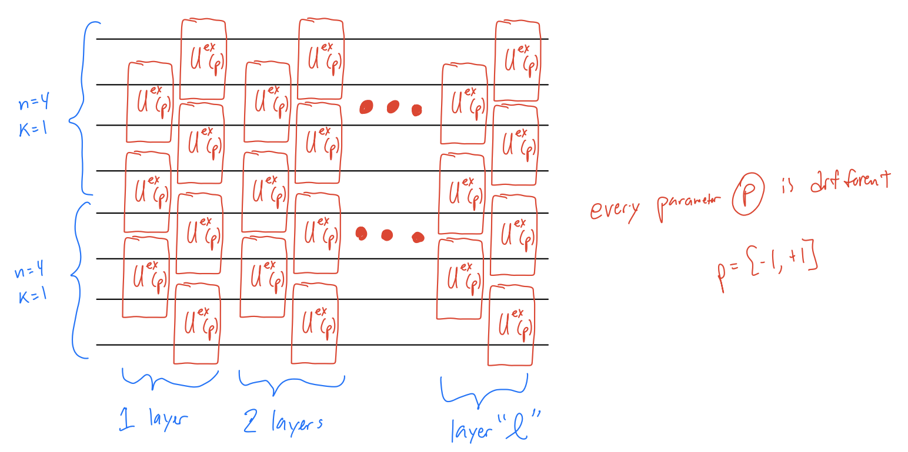

# EE514-final-project
Daniel and Aakash final project

## **Option 1: optimized encoded CNOT for N=4 through reinforcement learning**

This is the fixed ansatz with l=30 (30 fixed layers):

The unitary in the picture above with p=+1 or p=-1 represents the swap operator with some global phase. For the unitary with p=0 represents the identity operator on two physical qubits.

I shall use the fixed QNN architecture in the picture above (with 30 fixed layers) and use reinforcement learning to incentivize using more parameters with p=0 (identity operators) which means less number of non-identity parametrized  operators. This will allow us to find a compact version of the encoded CNOT operation on two logical qubits.

I am looking to use a reinforcement learning methods which are commonly used for continuous action spaces. Some examples are: Deep Q Networks (DQN) or policy gradient methods (e.g., Proximal Policy Optimization, Trust Region Policy Optimization), but will look into more.

## **Option 2: doing QEC for t=1 errors on VQE problem**

