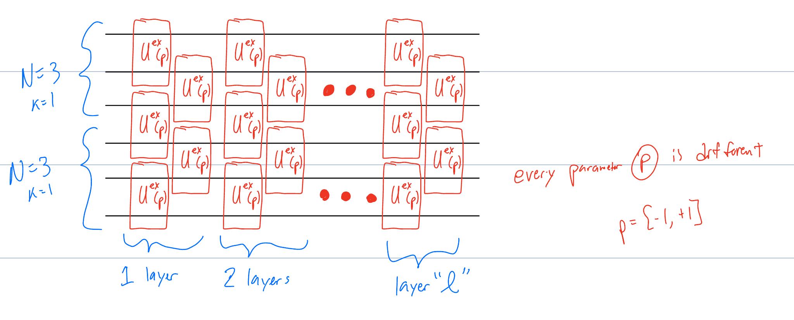

# EE514-final-project
Daniel and Aakash final project

## **How to run the code:**
#### 1. Make sure you have installed miniconda(https://docs.conda.io/projects/miniconda/en/latest/) through terminal and is recognizable by your environment variables
#### 2. Open your terminal, then `cd <into-the-root-of-this-folder>`, then run `bash runCode.sh` (you only need to do this once if you've done it right). That last script will create an virtual environment called `qrl` which will store all your dependencies
#####    - in case anything goes wrong during running the file. Use `conda activate qrl`, then `pip install <some-dependency>` as the errors come up. You will see what dependencies are essential when being used or not by the python notebooks.
#### 3. 2 types of networks to run:
##### type 1 (basic optimization) - Go to the `basic_neural_networks/matrix_optimization.ipynb` and run the entire notebook using the virtual environment `qrl`
##### type 2 (reinforcement learning) - Open terminal. Run `cd <root-dir-of-code>/reinforcement_learning` (goes to root of file). Run  `conda activate qrl`. Run `python main_ddpg.py`. 

## **Project Description: Optimized encoded CNOT for N=3 through reinforcement learning**

This is the fixed ansatz with l=10 (10 fixed layers):

The unitary in the picture above with p=+1 or p=-1 represents the swap operator with some global phase. The unitary with p=0 represents the identity operator on two physical qubits.

We used the QNN architecture above with some set of layers and used either reinforcement learning or basic minimization problem. 
- When using reinforcement learning we incentivized using more parameters with p=0 (identity operators) which means less number of non-identity parametrized  operators without sacrificing accuracy. This will allow us to find a compact version of the encoded CNOT operation on two logical qubits.
- When using the minimization problem, we just found the best parameters which minized the f_cnot_loss (what the actual Unitary gate does as logical CNOT)

